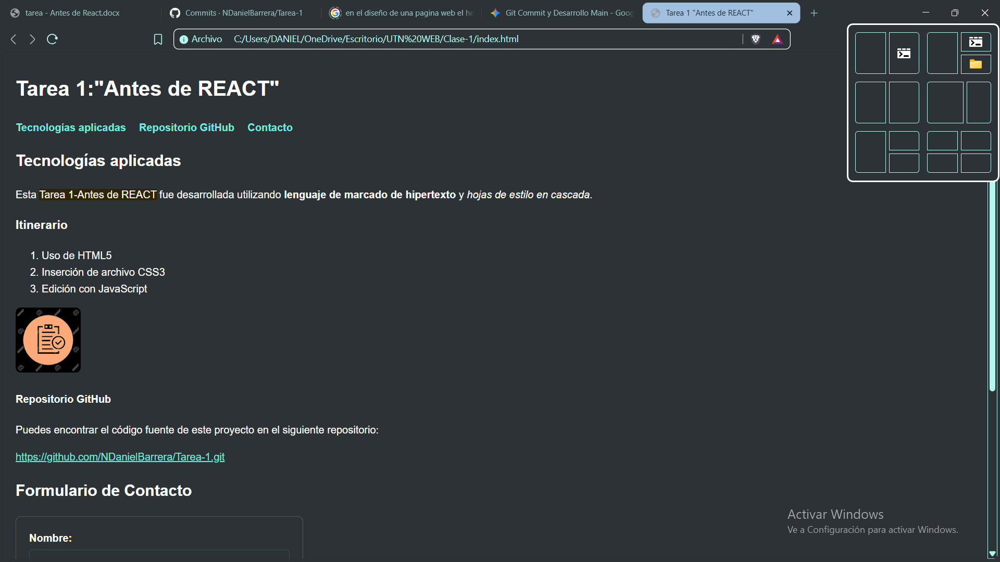
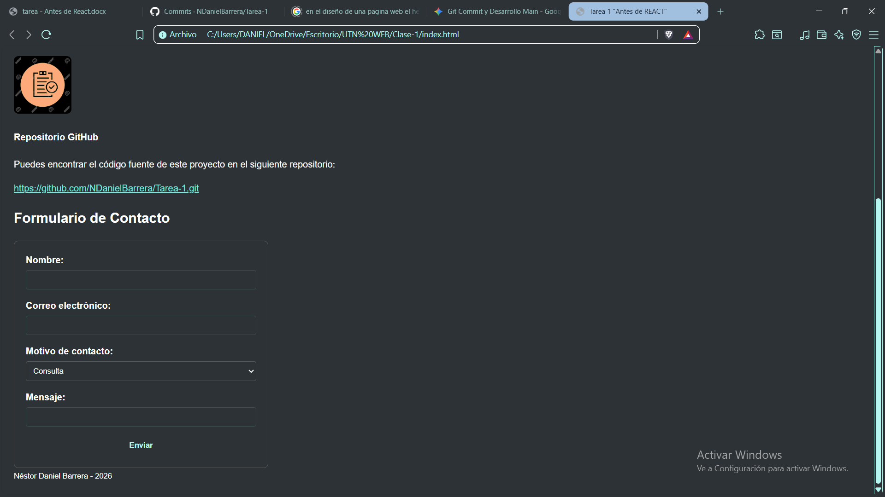

# Tarea 1: "Antes de REACT" - UTN.BA

Diplomatura en Desarrollo Web Full Stack con React.js.  
**Unidad 1:** Introducción al Desarrollo Web y maquetado semántico.

---

## 📄 Descripción del Proyecto
Este proyecto corresponde a la primera entrega práctica del curso, enfocada en consolidar las bases fundamentales del desarrollo web antes de avanzar hacia frameworks interactivos como React. Consiste en una página web estática maquetada con **HTML5 semántico** y estilizada mediante **CSS3 moderno** utilizando variables globales (`:root`), selectores avanzados, efectos de transición (*hover*) y diseño responsivo para formularios.

---

## 🛠️ Tecnologías Aplicadas
* **HTML5:** Estructuración semántica del contenido (`<header>`, `<main>`, `<article>`, `<section>`, `<footer>`).
* **CSS3:** Estilos avanzados, diseño de formularios, manejo de espaciados y uso de variables de diseño (`--color-principal`, `--color-secundario`, `--fuente-base`).
* **Git & GitHub:** Control de versiones y despliegue del repositorio.

---

## 🚀 Instrucciones de Uso

### Requisitos Previos
Necesitas tener instalado un navegador web moderno (Google Chrome, Mozilla Firefox, Microsoft Edge, etc.) y opcionalmente [Git](https://git-scm.com/) en tu equipo.

### 1. Clonar el repositorio
Abre tu terminal o consola de comandos y ejecuta el siguiente comando:
bash
git clone https://github.com/NDanielBarrera/Tarea-1.git

### 📸 Capturas de Pantalla

Así se ve el proyecto finalizado con los estilos aplicados: 
Imágenes: 

## 🗃️ Bibliografía y Fuentes Citadas
* **Estructura HTML:** Documentación oficial de [MDN Web Docs - HTML Semántico](https://developer.mozilla.org/es/docs/Glossary/Semantics#html_semantics).
* **Estilos y Variables:** Guía de uso de [MDN Web Docs - Variables CSS](https://developer.mozilla.org/es/docs/Web/CSS/Using_CSS_custom_properties).
* **Créditos de Imágenes:** La imagen `image.jpg` ubicada en la carpeta assets fue tomada del sitio "es.123RF.com.

## 👤 Créditos del Autor
* **Estudiante:** Néstor Daniel Barrera
* **Curso:** Certificación Full Stack Web Development con React.js
* **Institución:** Centro de e-Learning UTNBA (Universidad Tecnológica Nacional)
* **Año:** 2026
